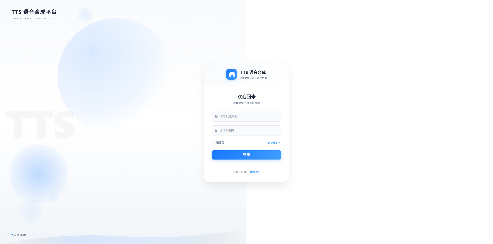
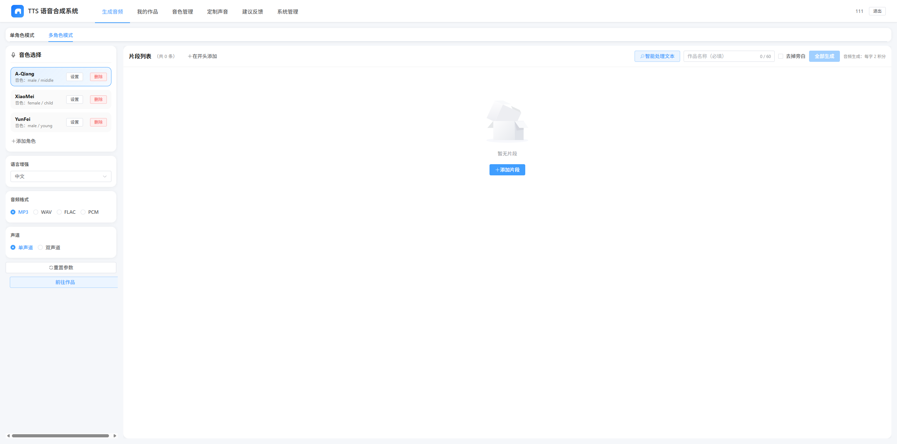
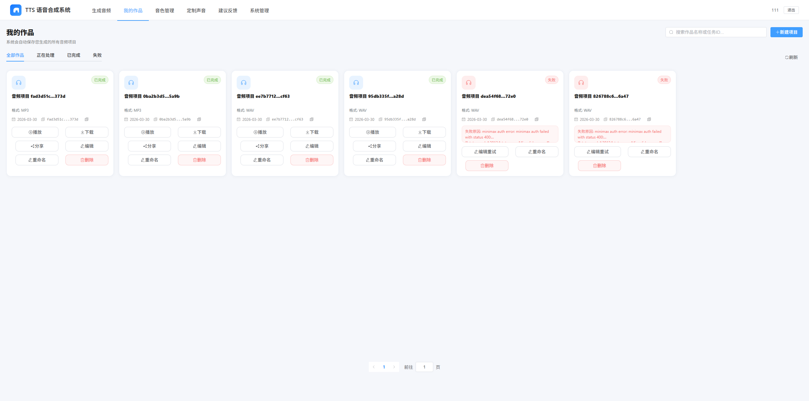
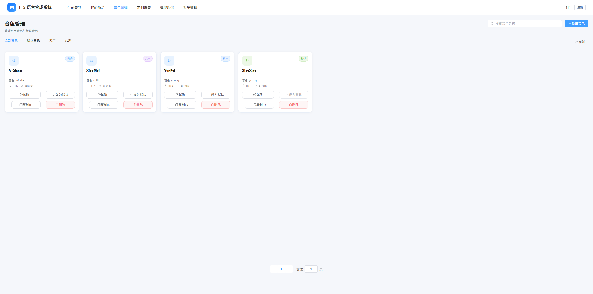
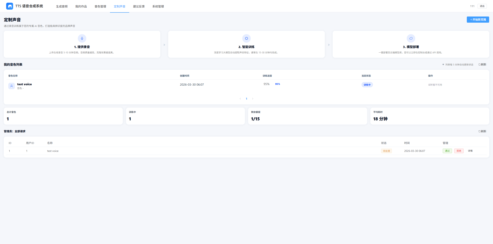
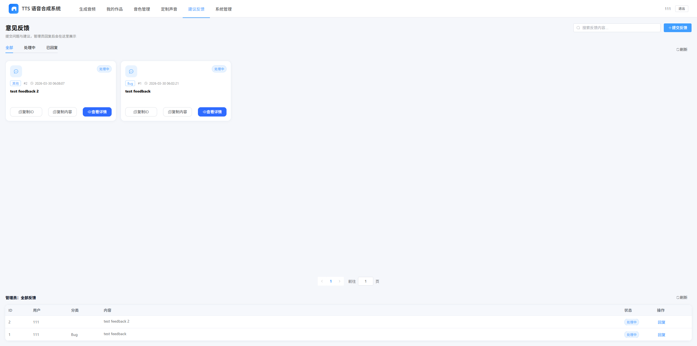
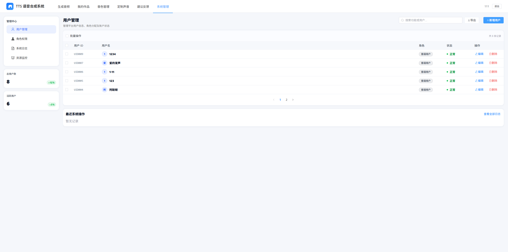

# TTS 语音合成平台

基于 Vue 3 + Vite + TypeScript + Element Plus 构建的智能文本转语音（Text-to-Speech）Web 应用。

**在线演示：** https://tts.itnan.fun

**GitHub 地址：** https://github.com/pipi596888/TTS

---

## 功能特性

- **多角色音频生成** — 支持单角色/多角色模式，可为不同片段分配不同音色
- **音色管理** — 音色试听、创建、删除、设为默认
- **声音克隆** — 通过录音样本训练专属 AI 音色
- **作品管理** — 播放、下载、分享、重命名、删除生成的音频
- **意见反馈** — 用户提交反馈，管理员回复
- **系统管理** — 用户管理、角色权限、系统日志、资源监控（管理员专属）

---

## 技术栈

| 类别 | 技术 |
|------|------|
| 框架 | Vue 3 (Composition API) |
| 构建 | Vite |
| 语言 | TypeScript |
| UI 组件 | Element Plus |
| 状态管理 | Pinia |
| 路由 | Vue Router |
| HTTP | Axios |

---

## 页面预览

### 1. 登录 / 注册页 (`/login`)

用户进入平台的第一入口，支持登录和注册两个模式切换。

**功能点：**
- 用户名 + 密码登录
- 记住登录状态
- 注册时填写用户名、邮箱、密码（含确认密码校验）
- 表单校验（用户名长度、邮箱格式、密码长度、两次密码一致性）
- 登录成功后自动跳转到 `/generate`



---

### 2. 音频生成页 (`/generate`)

核心创作页面，支持多角色多片段的文本转语音生成。

**功能点：**
- **单角色模式** — 所有片段使用同一音色
- **多角色模式** — 每个片段可分配不同角色（音色）
- 音色选择面板：添加/编辑/删除角色，分配音色
- 片段列表：双击修改文本、设置情绪（中性/开心/悲伤/愤怒）
- 语言增强：中文/英文/日文
- 音频格式：MP3 / WAV / FLAC / PCM
- 声道：单声道 / 双声道
- 智能处理文本开关
- 去掉旁白开关
- 填写作品名称后一键生成全部片段
- 生成完成后显示 AudioPlayer 播放器



---

### 3. 我的作品页 (`/works`)

展示用户生成的所有音频项目。

**功能点：**
- 作品卡片网格展示（封面、状态标签、格式、创建时间）
- 状态筛选：全部 / 正在处理 / 已完成 / 失败
- 关键词搜索（按作品名或任务ID）
- 自动刷新（处理中的作品每3秒刷新）
- 操作：播放 / 下载 / 分享 / 编辑重试 / 重命名 / 删除
- 底部播放器栏：上一首 / 播放暂停 / 下一首，进度条，音量调节

| 状态 | 样式 | 说明 |
|------|------|------|
| 处理中 | 蓝色 RUNNING | 正在生成，显示进度条 |
| 已完成 | 绿色 OK | 可播放、下载 |
| 失败 | 红色 BAD | 显示失败原因 |



---

### 4. 音色管理页 (`/voice`)

管理平台提供的所有音色。

**功能点：**
- 音色卡片网格展示
- 分类筛选：全部 / 默认音色 / 男声 / 女声
- 关键词搜索
- 音色试听（底部播放器栏）
- 创建新音色（名称、音色描述、性别）
- 设为默认音色
- 删除音色（需确认）



---

### 5. 定制声音页 (`/custom-voice`)

通过录音样本克隆专属声音。

**功能点：**
- 三步流程展示：提供录音 → 智能训练 → 模型部署
- 创建新克隆请求（名称、音色、性别、样本文本、样本链接）
- 训练进度实时展示（百分比进度条）
- 状态追踪：训练中 / 已可用 / 失败
- 立即试听（训练成功后）
- 详情抽屉（查看请求信息）
- 管理员模式：审核请求（通过/拒绝）



---

### 6. 意见反馈页 (`/feedback`)

提交问题与建议，查看管理员回复。

**功能点：**
- 反馈卡片网格展示
- 状态筛选：全部 / 处理中 / 已回复
- 关键词搜索
- 提交反馈（分类、内容、联系方式）
- 反馈分类：Bug / 功能建议 / 体验优化 / 其他
- 查看详情抽屉
- 复制反馈ID / 复制内容
- 管理员模式：查看所有反馈、回复用户



---

### 7. 系统管理页 (`/system`) — 管理员专属

平台后台管理中心，仅管理员（userId=1）可访问。

**功能点：**
- **用户管理** — 用户列表、搜索、新增、编辑角色、删除、导出
- **角色权限** — 角色分配与权限管理
- **系统日志** — 操作日志记录
- **资源监控** — 系统资源状态



---

## 项目结构

```
tts-front/
├── public/                  # 静态资源 + 页面截图
├── src/
│   ├── api/                # API 接口封装
│   │   ├── admin.ts
│   │   ├── customVoice.ts
│   │   ├── feedback.ts
│   │   ├── system.ts
│   │   ├── tts.ts
│   │   ├── user.ts
│   │   ├── voice.ts
│   │   └── works.ts
│   ├── assets/             # 静态资源
│   ├── components/         # 公共组件
│   │   ├── AudioPlayer/    # 音频播放器组件
│   │   ├── GeneratePanel/
│   │   ├── RolePanel/
│   │   ├── SegmentEditor/
│   │   └── VoiceSelector/
│   ├── router/             # 路由配置
│   │   └── index.ts
│   ├── store/              # Pinia 状态管理
│   │   ├── tts.ts
│   │   ├── user.ts
│   │   └── voice.ts
│   ├── types/              # TypeScript 类型定义
│   ├── utils/              # 工具函数
│   │   ├── audio.ts        # 音频下载工具
│   │   ├── passwordCipher.ts # 密码加密
│   │   └── request.ts      # Axios 封装
│   ├── views/              # 页面组件
│   │   ├── CustomVoice/    # 定制声音
│   │   ├── Feedback/       # 意见反馈
│   │   ├── GenerateAudio/  # 音频生成（核心）
│   │   ├── Login/          # 登录/注册
│   │   ├── SystemManage/   # 系统管理
│   │   ├── VoiceManage/    # 音色管理
│   │   └── Works/          # 我的作品
│   ├── App.vue
│   ├── main.ts
│   └── style.css
├── index.html
├── package.json
├── tsconfig.json
├── vite.config.ts
└── README.md
```

---

## 开发启动

```bash
# 安装依赖
npm install

# 启动开发服务器
npm run dev

# 构建生产版本
npm run build
```

**默认访问：** http://localhost:3000

> 若遇到 `spawn EPERM`（Windows），通常是安全软件拦截 `esbuild` 子进程，建议将项目目录加入白名单或以管理员权限运行终端。

---

## 环境变量

创建 `.env` 文件配置后端 API 地址：

```env
VITE_API_BASE_URL=http://localhost:8080
```

---

## License

MIT
